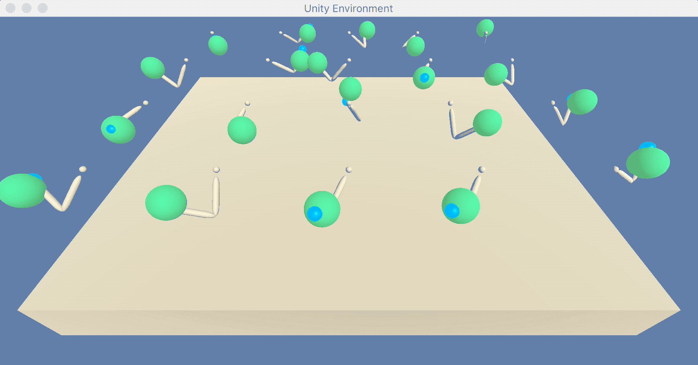

# udacity-p2_continuous_control
This is a repository for project 2-continuous-control of udacity DRLND program

## Project Details
This project is one of the udactiy deep reinforcement learning nano degree program. The environment you will work with is Unity ML-Agents Reacher. please refer to details [here](https://github.com/Unity-Technologies/ml-agents/blob/master/docs/Learning-Environment-Examples.md#reacher) for the enviroment.

The goal of this project is to train an agent to move a double-jointed arm to a target location and maintain its position at the target location for as many time steps as possible.

A reward of +0.1 is provided for each step that the agent's hand is in the goal location.
The observation space consists of 33 variables corresponding to position, rotation, velocity, and angular velocities of the arm. Each action is a vector with four numbers, corresponding to torque applicable to two joints. Every entry in the action vector should be a number between -1 and 1.

#### Distributed Training
For this project, multi-agents version of the Unity enviroment which contains 20 identical agents, each with its own copy of the environments has been used. This version is useful for algorithms like PPO, A3C, and D4PG that use multiple (non-interacting, parallel) copies of the same agent to distribute the task of gathering experience.

#### Solve the Environments
Agents must get an average score of +30 (over 100 consecutive episodes, and over all agents)

- After each episode, we add up the rewards that each agent received (without discounting), to get a score for each agent. This yields 20 (potentially different) scores. We then take the average of these 20 scores.
- This yields an **average score** for each episode (where the average is over all 20 agents).

The environment is considered solved, when the average (over 100 episodes) of those average scores is at least +30.

## Getting Started
Follow the instructions below to explore the environment on your own machine!

#### Step 1: Activate the Environment
If you haven't already, please follow the [instructions in the DRLND GitHub repository](https://github.com/udacity/deep-reinforcement-learning#dependencies) to set up your Python environment. These instructions can be found in README.md at the root of the repository. By following these instructions, you will install PyTorch, the ML-Agents toolkit, and a few more Python packages required to complete the project.

#### Step 2: Download the Unity Environment

For this project, you will not need to install Unity - you can download it from one of the links below. You need only select the environment that matches your operating system:

**Version 1: One (1) Agent**
- Linux: [click here](https://s3-us-west-1.amazonaws.com/udacity-drlnd/P2/Reacher/one_agent/Reacher_Linux.zip)
- Mac OSX: [click here](https://s3-us-west-1.amazonaws.com/udacity-drlnd/P2/Reacher/one_agent/Reacher.app.zip)
- Windows (32-bit): [click here](https://s3-us-west-1.amazonaws.com/udacity-drlnd/P2/Reacher/one_agent/Reacher_Windows_x86.zip)
- Windows (64-bit): [click here](https://s3-us-west-1.amazonaws.com/udacity-drlnd/P2/Reacher/one_agent/Reacher_Windows_x86_64.zip)

**Version 2: Twenty (20) Agents**
- Linux: [click here](https://s3-us-west-1.amazonaws.com/udacity-drlnd/P2/Reacher/Reacher_Linux.zip)
- Mac OSX: [click here](https://s3-us-west-1.amazonaws.com/udacity-drlnd/P2/Reacher/Reacher.app.zip)
- Windows (32-bit): [click here](https://s3-us-west-1.amazonaws.com/udacity-drlnd/P2/Reacher/Reacher_Windows_x86.zip)
- Windows (64-bit): [click here](https://s3-us-west-1.amazonaws.com/udacity-drlnd/P2/Reacher/Reacher_Windows_x86_64.zip)

Then, place the file in the p2_continuous-control/ folder in the DRLND GitHub repository, and unzip (or decompress) the file.

## Instructions
Follow the instructions in continuous_control_multi.ipynb to get started with training your own agent! You can train agenets to move a double-jointed arm to a target location and keep its position at the target location.

After finishing your agent training, you can check a score by plotting average scores over episodes.
It will tell you how many epsiodes in your model are needed to get +30 average score. you can also save model weights and load it later.

